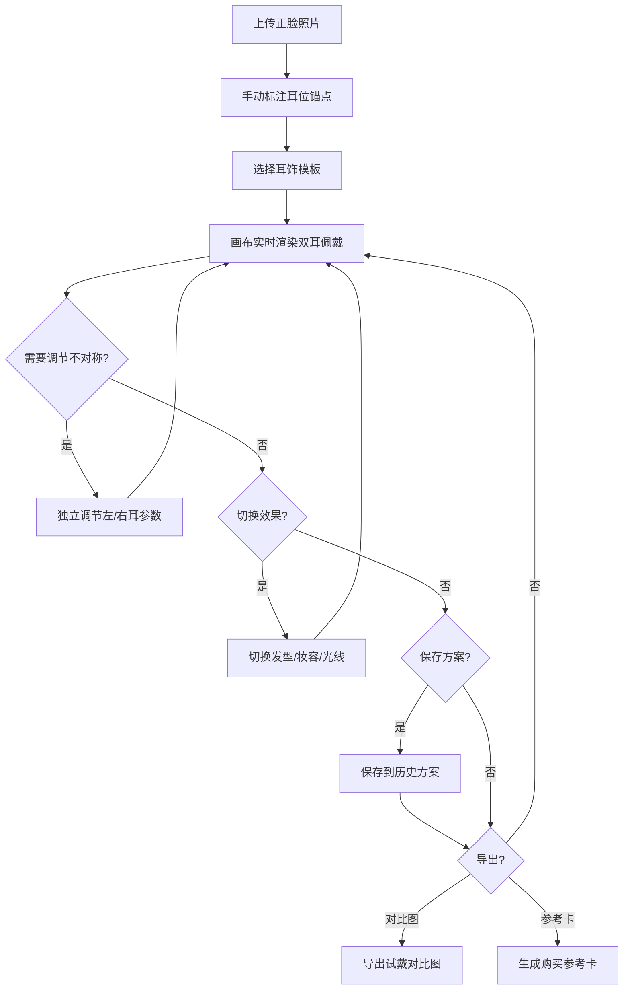

## 1. 产品概述

"耳饰试戴与左右脸不对称预览器"是一款纯前端虚拟试戴工具，用户上传正脸照片后可模拟双耳佩戴耳饰效果，并独立调节左右耳参数以适配脸部轻微不对称，同时支持发型遮挡、妆容色调和光线模式的切换预览。

- 目标用户：喜欢在线选购耳饰、关注脸部对称性穿搭的消费者及美妆博主
- 核心价值：零成本虚拟试戴，精准适配不对称脸型，一键导出对比图与购买参考卡

## 2. 核心功能

### 2.1 功能模块

1. **主画布页**：人像画布（上传照片+耳饰叠加渲染）、耳饰素材库、左右校准面板、效果切换区、历史方案区
2. **导出页（弹窗）**：试戴对比图导出、购买参考卡生成

### 2.2 页面详情

| 页面名称 | 模块名称 | 功能描述 |
|---------|---------|---------|
| 主画布页 | 照片上传区 | 拖拽或点击上传正脸照片，显示在画布中央 |
| 主画布页 | 人像画布 | Canvas 渲染人像+耳饰叠加效果，支持缩放和平移 |
| 主画布页 | 耳饰素材库 | 提供耳钉、耳坠、圈环、流苏等模板分类，SVG/Canvas 绘制 |
| 主画布页 | 左耳校准面板 | 独立调节左耳耳饰的X/Y偏移、缩放、旋转角度 |
| 主画布页 | 右耳校准面板 | 独立调节右耳耳饰的X/Y偏移、缩放、旋转角度 |
| 主画布页 | 效果切换区 | 发型遮挡开关、妆容色调滤镜（暖粉/冷蓝/自然/复古）、光线模式（自然光/暖光/冷光/舞台光） |
| 主画布页 | 历史方案区 | 展示已保存方案缩略图，支持加载、删除、重命名 |
| 导出弹窗 | 对比图导出 | 生成左右对比图（原图 vs 佩戴效果），下载为PNG |
| 导出弹窗 | 购买参考卡 | 生成含耳饰名称、佩戴效果、参数信息的参考卡片，下载为PNG |

## 3. 核心流程

用户上传正脸照片 → 系统自动识别耳朵位置（手动微调锚点）→ 从素材库选择耳饰 → 画布实时渲染双耳佩戴效果 → 独立调节左右耳参数适配不对称 → 切换发型/妆容/光线查看整体效果 → 保存方案到历史记录 → 导出对比图或购买参考卡

## 4. 用户界面设计

### 4.1 设计风格

- **主色调**：深炭灰底色（#1a1a2e）+ 香槟金点缀（#d4a574），营造高端珠宝试戴氛围
- **辅助色**：暖象牙白（#f5f0e8）用于文字，玫瑰金（#b76e79）用于交互高亮
- **按钮风格**：圆角胶囊按钮，金色描边+半透明背景，hover时全金填充
- **字体**：展示字体使用 Playfair Display（标题），正文使用 Noto Sans SC
- **布局**：左侧人像画布（占60%宽），右侧工具面板（素材库+校准+效果），底部历史方案条
- **图标**：线性图标风格，统一使用 lucide-vue-next

### 4.2 页面设计概览

| 页面名称 | 模块名称 | UI元素 |
|---------|---------|--------|
| 主画布页 | 人像画布 | 深色背景、居中画布、金色边框装饰、缩放控件 |
| 主画布页 | 耳饰素材库 | 水平滚动卡片列表、分类标签页、选中金色高亮 |
| 主画布页 | 左/右校准面板 | 滑块组（X偏移/Y偏移/缩放/旋转）、重置按钮、实时预览 |
| 主画布页 | 效果切换区 | 开关按钮组、色调色块选择、光线模式图标卡片 |
| 主画布页 | 历史方案区 | 底部横向缩略图条、hover放大、删除/加载图标 |
| 导出弹窗 | 对比图/参考卡 | 居中弹窗、预览画布、下载按钮、关闭按钮 |

### 4.3 响应式

- 桌面优先设计，最小宽度 1200px
- 画布区自适应高度，保持宽高比
- 面板区可折叠，小屏幕下转为底部抽屉

### 4.4 动效

- 耳饰选中时的弹跳过渡动画
- 滑块调节时画布实时平滑更新
- 方案保存时的闪光提示动画
- 页面加载时金色渐入效果
