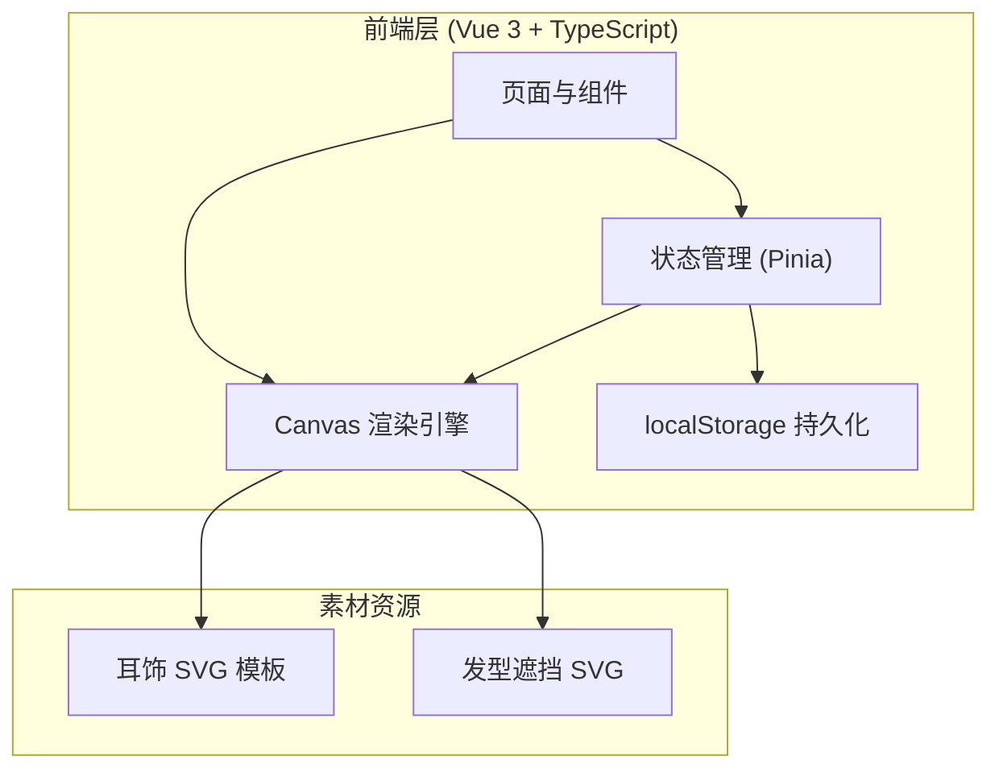

## 1. 架构设计



## 2. 技术说明

- **前端**：Vue 3 + TypeScript + Tailwind CSS + Vite
- **初始化工具**：vite-init（vue-ts 模板）
- **状态管理**：Pinia
- **后端**：无（纯前端）
- **数据存储**：localStorage（方案数据）+ Canvas toDataURL（图片导出）

## 3. 路由定义

| 路由 | 用途 |
|------|------|
| / | 主画布页（上传照片、试戴、校准、效果切换、历史方案） |

单页应用，所有功能在同一页面内通过面板切换和弹窗实现。

## 4. 核心数据结构

### 4.1 耳饰模板

```typescript
interface EarringTemplate {
  id: string
  name: string
  category: 'stud' | 'drop' | 'hoop' | 'tassel'
  svgPath: string
  defaultWidth: number
  defaultHeight: number
  anchorPoint: { x: number; y: number }
}
```

### 4.2 耳饰实例（佩戴状态）

```typescript
interface EarringInstance {
  templateId: string
  side: 'left' | 'right'
  offsetX: number
  offsetY: number
  scale: number
  rotation: number
  anchorX: number
  anchorY: number
}
```

### 4.3 效果配置

```typescript
interface EffectConfig {
  hairstyleOverlay: boolean
  makeupTone: 'natural' | 'warm' | 'cool' | 'vintage'
  lightingMode: 'natural' | 'warm' | 'cool' | 'stage'
}
```

### 4.4 方案数据

```typescript
interface Scheme {
  id: string
  name: string
  thumbnail: string
  createdAt: number
  photoData: string
  leftEarring: EarringInstance
  rightEarring: EarringInstance
  effect: EffectConfig
}
```

### 4.5 应用状态

```typescript
interface AppState {
  photo: string | null
  leftAnchor: { x: number; y: number }
  rightAnchor: { x: number; y: number }
  leftEarring: EarringInstance | null
  rightEarring: EarringInstance | null
  selectedTemplate: EarringTemplate | null
  effect: EffectConfig
  schemes: Scheme[]
  canvasScale: number
  canvasOffset: { x: number; y: number }
}
```

## 5. Canvas 渲染流程

1. 绘制底图（用户上传的照片）
2. 应用妆容色调滤镜（Canvas filter 或 globalCompositeOperation）
3. 绘制发型遮挡层（如开启）
4. 根据锚点位置+偏移/缩放/旋转参数绘制左耳饰
5. 根据锚点位置+偏移/缩放/旋转参数绘制右耳饰
6. 应用光线模式叠加层（半透明渐变）

## 6. 关键交互逻辑

- **锚点标注**：用户上传照片后，画布显示两个可拖拽锚点标记左右耳位置
- **实时预览**：滑块调节时通过 requestAnimationFrame 实时重绘 Canvas
- **方案保存**：将当前状态序列化为 JSON 存入 localStorage，同时生成缩略图
- **对比图导出**：左半绘制原图，右半绘制佩戴效果，中间添加分隔线
- **购买参考卡**：在佩戴效果图下方附加耳饰信息区域，整体导出为 PNG
